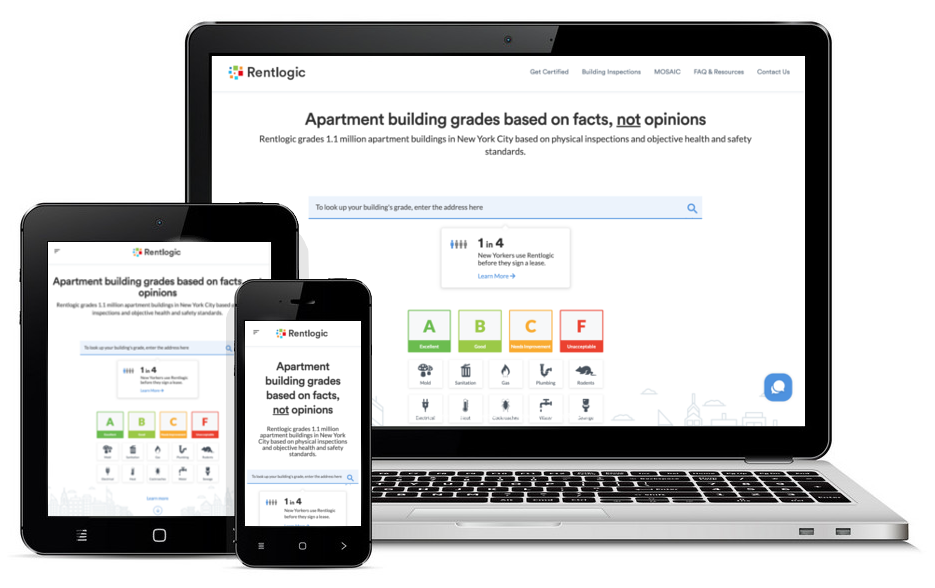

<!DOCTYPE html>
<html lang="en">

<!-- Mirrored from joefclarin.github.io/ by HTTrack Website Copier/3.x [XR&CO'2014], Mon, 09 Nov 2020 06:51:56 GMT -->
<!-- Added by HTTrack --><meta http-equiv="content-type" content="text/html;charset=utf-8" /><!-- /Added by HTTrack -->
<head>

  <meta charset="utf-8">
  <meta name="viewport" content="width=device-width, initial-scale=1, shrink-to-fit=no">
  <meta name="description" content="">
  <meta name="author" content="">

  <title>Joefrenette Joy Clarin</title>

  <!-- Bootstrap core CSS -->
  <link href="vendor/bootstrap/css/bootstrap.min.css" rel="stylesheet">

  <!-- Custom fonts for this template -->
  <link href="https://fonts.googleapis.com/css?family=Saira+Extra+Condensed:500,700" rel="stylesheet">
  <link href="https://fonts.googleapis.com/css?family=Muli:400,400i,800,800i" rel="stylesheet">
  <link href="vendor/fontawesome-free/css/all.min.css" rel="stylesheet">

  <!-- Custom styles for this template -->
  <link href="css/resume.min.css" rel="stylesheet">

</head>

<body id="page-top">

  <nav class="navbar navbar-expand-lg navbar-dark bg-primary fixed-top" id="sideNav">
    <a class="navbar-brand js-scroll-trigger" href="#page-top">
      Shavinda De Silva
      
        
      
    </a>
    <button class="navbar-toggler" type="button" data-toggle="collapse" data-target="#navbarSupportedContent" aria-controls="navbarSupportedContent" aria-expanded="false" aria-label="Toggle navigation">
      
    </button>
    

      <ul class="navbar-nav">
        <li class="nav-item">
          <a class="nav-link js-scroll-trigger" href="#about">About</a>
        </li>
        <li class="nav-item">
          <a class="nav-link js-scroll-trigger" href="#experience">Experience</a>
        </li>
        <li class="nav-item">
          <a class="nav-link js-scroll-trigger" href="#volunteer">Volunteer</a>
        </li>
        <li class="nav-item">
          <a class="nav-link js-scroll-trigger" href="#education">Education</a>
        </li>
        <li class="nav-item">
          <a class="nav-link js-scroll-trigger" href="#skills">Skills</a>
        </li>
        <li class="nav-item">
          <a class="nav-link js-scroll-trigger" href="#projects">Projects</a>
        </li>
        <li class="nav-item">
          <a class="nav-link js-scroll-trigger" href="#interests">Interests</a>
        </li>
      </ul>
    

  </nav>

  

    <section class="resume-section p-3 p-lg-5 d-flex align-items-center" id="about">
      

        <h1 class="mb-0">Shavinda De
          Silva
        </h1>
        
7 5A Riverside Dr, Bedford Park, Adelaide SA, Australia · (61) 0451 836 493 ·
          <a href="mailto:shavinda34@gmail.com">shavinda34@gmail.com</a>
        

        
I am experienced in software and web development with an excellent understanding of concepts of programming practices on both back-end and front-end. With my experience with various job positions, I learned a range of different skills in both technical and project management. 

        

          <a href="https://www.linkedin.com/in/shavinda/">
            <i class="fab fa-linkedin-in"></i>
          </a>
          <a href="https://github.com/shavinda">
            <i class="fab fa-github"></i>
          </a>
          <a href="https://www.facebook.com/shavi.decode">
            <i class="fab fa-facebook-f"></i>
          </a>
        

      

    </section>

    

    <section class="resume-section p-3 p-lg-5 d-flex justify-content-center" id="experience">
      

        <h2 class="mb-5">Experience</h2>

        

          

            <h3 class="mb-0">Web Developer</h3>
            
LKDesign

            

              <ul>
                <li>Converts beautiful designs into a working and responsive websites</li>
                <li>Updates existing websites based on the client requirements</li>
                <li>Main technologies used are PHP MVC, WordPress and Elementor Pro</li>
              </ul>
            

          

          

            
Apr 2017 - AUG 2019

            
Full Time

          

        

        

          

            <h3 class="mb-0">Project Lead</h3>
            
Wso2 

            

              <ul>
                <li>Gathers and documents requirements from stakeholders</li>
                <li>Creates mockup designs to properly present the requirements will be use by developers as basis</li>
                <li>Creates a user manual that will be used by the QA team when testing the application. This is updated every version release</li>
                <li>Breakdown and estimate tasks for developers</li>
                <li>Checks and confirms the reported issues of the QA team before releasing them to the developers</li>
                <li>Plans and decides which modules or features should be included in the release</li>
                <li>Do demonstrations to stakeholders the latest version of the application</li>
                <li>Monitors the ongoing tasks of the developers and checks if everything is going smoothly</li>
              </ul>
            

          

          

            
Dec 2016 - Feb 2017

            
Full Time

          

        

        

          

            <h3 class="mb-0">Web Developer</h3>
            
K8 Applied Innovation, Inc

            

              <ul>
                <li>Develop web-based applications, customizations and UI changes on the client websites</li>
                <li>Develop, customize and implement high-quality web solutions that meet company expectations and requirements.</li>
                <li>Meet regularly with stakeholders to provide status updates, reports on development and discuss project/product objectives and timeframes.</li>
                <li>Program in HTML5, CSS3, JavaScript, MySQL, PHP and other web development languages, as needed, to create custom web applications and designs.</li>
                <li>Troubleshooting and resolving cross-platform/browser issues, performance optimization, and other aspects of managing web server platforms.</li>
              </ul>
            

          

          

            
Nov 2017 - Feb 2020

            
Full Time

          

        

        

          

            <h3 class="mb-0">Component Owner</h3>
            
Nokia Networks - Nokia Manila Technology Center

            

              <ul>
                <li>Contact person for the assigned project</li>
                <li>Researches and collects the requirements of the project</li>
                <li>Acts as the product owner on scrum activities</li>
                <li>Knows the ins and outs of the assigned project</li>
                <li>Decision maker on what needs to be prioritized on the project</li>
              </ul>
            

          

          

            
May 2016 - Nov 2017

            
Full Time

          

        

        

          

            <h3 class="mb-0">Research and Development Engineer</h3>
            
Nokia Networks - Nokia Manila Technology Center

            

              <ul>
                <li>Designs, develops, modifies, documents, tests, implements, and supports software applications and systems</li>
                <li>Researches and Identifies software limitations and deficiencies and plans and recommends solutions</li>
                <li>Contributes, modifies and designs the coding standards</li>
                <li>Analysis of technology needs based on proposed/new standards with the given specifications</li>
                <li>Gets acquainted with the tools, methods of working and processes linked to the job</li>
                <li>Is responsible for sharing knowledge in their expertise area</li>
                <li>Learns how to estimate work amounts in own area</li>
                <li>Solves engineering problems possibly with support from other team members</li>
                <li>Implementation and verification of feature sets for new or latest products</li>
                <li>Writes requirements, specifications and other guiding documentation for research and development from a technical point of view</li>
                <li>Give inputs in architectural discussions</li>
                <li>Develop software verification plans and quality assurance procedures</li>
              </ul>
            

          

          

            
Feb 2013 - Nov 2017

            
Full Time

          

        

        

          

            <h3 class="mb-0">Developer</h3>
            
Vizwoz Software Development Systems, Inc

            

              <ul>
                <li>Designs and develops plugins for business process and services being supported by System Center Service Manager (SCSM)</li>
                <li>Tests, maintains and updates existing System Center Service Manager (SCSM) plugins</li>
                <li>Modifies and creates new features for System Center Service Manager (SCSM) that will be used by clients for their business processes</li>
                <li>Reverse engineering System Center Service Manager (SCSM) codes to understand the ins and outs of how the built-in plugin work</li>
                <li>Diagnose and correct the problems of the overall operational and effectiveness of implemented solutions</li>
                <li>Development efforts including research and testing to determine the best product of its type</li>
              </ul>
            

          

          

            
Aug 2012 - Jan 2013

            
Full Time

          

        

        

          

            <h3 class="mb-0">PHP Developer</h3>
            
HP Outsourcing, Inc

            

              <ul>
                <li>Understands technical and functional design requirements to ensure programs perform based on the given specifications</li>
                <li>Assisting in physical and logical database design</li>
                <li>Designing, coding and testing technical solutions to ensure quality output</li>
                <li>Identifies system limitations and deficiencies and recommends solutions</li>
                <li>Understands the necessity of and contributes to coding standards</li>
              </ul>
            

          

          

            
Apr 2011 - Jun 2012

            
Full Time

          

        

      

    </section>

    

    <section class="resume-section p-3 p-lg-5 d-flex justify-content-center" id="volunteer">
      

        <h2 class="mb-5">Volunteer Work</h2>

        

          

            <h3 class="mb-0">Web Assistant</h3>
            
Stardusk FM

            

              <ul>
                <li>Assists in any tasks that needs any programming expertise in PHP, MySQL and WordPress</li>
              </ul>
            

          

          

            Mar 2020 - Present
          

        

        

          

            <h3 class="mb-0">Web Developer</h3>
            
Dagatan Family Farm School

            

              <ul>
                <li>Created website using WordPress and Oxygen builder</li>
                <li>Maintains the website for any changes that needs technical skills</li>
                <li>Trains or creates document on how to use or navigate the website</li>
              </ul>
            

          

          

            Oct 2019 - Present
          

        

      

    </section>

    

    <section class="resume-section p-3 p-lg-5 d-flex align-items-center" id="education">
      

        <h2 class="mb-5">Education</h2>

        

          

            <h3 class="mb-0">Deakin University</h3>
            
Masters of Information Technology

          

          

            Feb 2019
          

        

        

          

            <h3 class="mb-0">University of Westminister</h3>
            
Bachelor of engineering (hons)

          

          

            Jun 2014 - Mar 2017
          

        

      

    </section>
    
    

    <section class="resume-section p-3 p-lg-5 d-flex align-items-center" id="skills">
      

        <h2 class="mb-5">Skills</h2>

        
Programming Languages &amp; Tools

        <ul class="list-inline dev-icons">
          <li class="list-inline-item">
            <i class="fab fa-html5"></i>
          </li>
          <li class="list-inline-item">
            <i class="fab fa-css3-alt"></i>
          </li>
          <li class="list-inline-item">
            <i class="fab fa-js"></i>
          </li>
          <li class="list-inline-item">
            <i class="fab fa-wordpress"></i>
          </li>
          <li class="list-inline-item">
            <i class="fab fa-sass"></i>
          </li>
          <li class="list-inline-item">
            <i class="fab fa-less"></i>
          </li>
          <li class="list-inline-item">
            <i class="fab fa-git"></i>
          </li>
          <li class="list-inline-item">
            <i class="fab fa-npm"></i>
          </li>
          <li class="list-inline-item">
            <i class="fab fa-node-js"></i>
          </li>
          <!--li class="list-inline-item">
            <i class="fab fa-angular"></i>
          </li-->
        </ul>

        
Programing Languages & Technologies

        <ul class="fa-ul mb-3">
          <li>
            <i class="fa-li fa fa-check"></i>
            PHP</li>
          <li>
            <i class="fa-li fa fa-check"></i>
            HTML 5 & CSS </li>
          <li>
            <i class="fa-li fa fa-check"></i>
           JavaScript and Frameworks - AngularjS</li>
          <li>
            <i class="fa-li fa fa-check"></i>
            Agile Development</li>
            <li>
              <i class="fa-li fa fa-check"></i>
              Version Control</li>
            <li>
              <i class="fa-li fa fa-check"></i>
              PHP OOP Concepts & MVC Frameworks</li>
        </ul>

        
Digital Marketing Tools expert

        <ul class="fa-ul mb-3">
          <li>
            <i class="fa-li fa fa-check"></i>
            PPC - Adwords/facebookads</li>
          <li>
            <i class="fa-li fa fa-check"></i>
            SEO/SEM Concepts - Onsite / Offsite </li>
          <li>
            <i class="fa-li fa fa-check"></i>
            Website Monetization Concepts</li>
          <li>
            <i class="fa-li fa fa-check"></i>
            Email & Social Media campains</li>
        </ul>

        
Workflow

        <ul class="fa-ul mb-3">
          <li>
            <i class="fa-li fa fa-check"></i>
            Responsive Design</li>
          <li>
            <i class="fa-li fa fa-check"></i>
            Cross Browser Testing &amp; Debugging</li>
          <li>
            <i class="fa-li fa fa-check"></i>
            Cross Functional Teams</li>
          <li>
            <i class="fa-li fa fa-check"></i>
            Agile Development &amp; Scrum</li>
        </ul>

        
Soft Skills

        <ul class="fa-ul mb-0">
          <li>
              <i class="fa-li fa fa-check"></i>
              Project Management</li>
          <li>
              <i class="fa-li fa fa-check"></i>
              Requirements Gathering</li>
          <li>
              <i class="fa-li fa fa-check"></i>
              Documentation</li>
          <li>
              <i class="fa-li fa fa-check"></i>
              Training People</li>
          </ul>

      

    </section>

    

    <section class="resume-section p-3 p-lg-5 d-flex align-items-center" id="projects">
      

        <h2 class="mb-5">Projects</h2>
        
        

          

            <h3 class="mb-0">Brightt</h3>
            
Website under construction

            <!--div class="subheading mb-3"><a target="_blank" href="https://brightt.com.au">brightt.com.au</a></div-->
            
WordPress, Elementor Pro

            

          

          

            

              
            

          

        

        
        

          

            <h3 class="mb-0">WorkSafe Guardian</h3>
            
Website under construction

            <!--div class="subheading mb-3"><a target="_blank" href="https://worksafeguardian.com.au">worksafeguardian.com.au</a></div-->
            
WordPress, Elementor Pro

            
Creator of Australia'a best lone worker safety alert app which is trusted by hundreds of organisations to protect their most valuable asset – their employees.

          

          

            

              
            

          

        

        
        

          

            <h3 class="mb-0">Fly Library</h3>
            
Website under construction

            <!--div class="subheading mb-3"><a target="_blank" href="https://frylibrary.com.au">frylibrary.com.au</a></div-->
            
WordPress, Elementor Pro, Woocommerce

            
Fry Library and School Supplies was established in 1997 by Brett and Marie Fry and are a proud Australian family owned business.

          

          

            

              
            

          

        

        
        

          

            <h3 class="mb-0">Anomaly 2.0</h3>
            
Website under construction

            <!--div class="subheading mb-3"><a target="_blank" href="https://anomaly.com.au">anomaly.com.au</a></div-->
            
WordPress, Elementor Pro

            
Anomaly is an Adelaide based creative agency that offers video production, marketing and advertising.

          

          

            

              
            

          

        

        

          

            <h3 class="mb-0">Tattoo With Intention</h3>
            
<a target="_blank" href="http://tattoowithintention.com.au/">tattoowithintention.com.au</a>

            
WordPress, Elementor Pro, Woocommerce

            
Tattoo With Intention is a tattoo studio and school run by Pablo Mascia. Pablo is an experienced and passionate tattoo artist who has been researching the old ways of tattooing alongside the benefits of using tattooing as a healing tool for the past 10 years.

          

          

            

              
            

          

        

        

          

            <h3 class="mb-0">Pathway Bookkeeping</h3>
            
Website under construction

            <!--div class="subheading mb-3"><a target="_blank" href="http://pathwaybookkeeping.com.au/">pathwaybookkeeping.com.au</a></div-->
            
WordPress, Elementor Pro

            
Pathway Bookkeeping is an accounting firm dedicated to making managing your books simple and easy.

          

          

            

              
            

          

        

        

          

            <h3 class="mb-0">Awoken Film</h3>
            
<a target="_blank" href="https://awokenfilm.com/">awokenfilm.com</a>

            
WordPress, Elementor Pro, Revolution Slider

            
Awoken is a horror-thriller film from first time writer/director Daniel J. Phillips, and it has been released in North America by Vertical Entertainment on May 8th, 2020. Included as part of their release strategy, Awoken will be available to rent or buy on all major VOD/Digital platforms such as Amazon, VUDU, Apple TV and iTunes, among others.

          

          

            

              
            

          

        

        
        

          

            <h3 class="mb-0">Network Angel (Deutsch)</h3>
            
<a target="_blank" href="https://www.network-angel.de/">www.network-angel.de</a>

            
WordPress, Elementor Pro

            
Network Angel is the website of Miriam J. Hohenfeldt. She has years of experience with a solid foundation as a business coach and specialist for sales and networking.

          

          

            

              
            

          

        

        
        

          

            <h3 class="mb-0">Marc & Co Building Solutions</h3>
            
<a target="_blank" href="https://www.macbs.com.au/">macbs.com.au</a>

            
WordPress, Elementor Pro

            
Marc & Co Building Solutions have combined 26 years experience with a vision to be the builder of choice for those looking for custom quality builds. Marc & Co specialising in residential services and offers wide range of services from new builds to renovations.

          

          

            

              
            

          

        

        
        

          

            <h3 class="mb-0">Bolton Brothers</h3>
            
<a target="_blank" href="https://boltonbrothers.com.au/">boltonbrothers.com.au</a>

            
WordPress, Elementor Pro

            
Bolton Brothers deliver mental health services that are designed not just for men, but with men, to ensure they are relevant, accessible, timely and effective.

          

          

            

              
            

          

        

        
        

          

            <h3 class="mb-0">Dagatan Family Farm School</h3>
            
<a target="_blank" href="http://dagatanffs.org/">dagatanffs.org</a>

            
WordPress, Oxygen builder

            
Dagatan Family Farm School is a school in Batangas Philippines that caters grades 7 to 10 students.

          

          

            

              
            

          

        

        <!--div class="resume-item d-flex flex-column flex-md-row justify-content-between mb-5">
          

            <h3 class="mb-0">Party Social</h3>
            
<a target="_blank" href="https://www.partysocial.com">partysocial.com</a>

            
Joomla, JomSocial plugin

            
Party Social is a social media for party goers. Anyone can share their photos, videos and their party status.

          

          

            

              
            

          

        </div-->

        

          

            <h3 class="mb-0">Edward Kopko</h3>
            
<a target="_blank" href="https://www.edkopko.com/">edkopko.com</a>

            
WordPress, Elementor Pro

            
Edward Kopko website showcases Ed’s portfolio, accomplishments, works and to promote his new book, Project Bold Life.

          

          

            

              
            

          

        

        

          

            <h3 class="mb-0">Artemis</h3>
            
<a target="_blank" href="https://artemiscapitaladvisory.com/">artemiscapitaladvisory.com</a>

            
WordPress, Elementor Pro

            
Artemis Capital Advisory offers advice to sponsors and companies on raising capital, investor relations and general marketing strategies.

          

          

            

              
            

          

        

        

          

            <h3 class="mb-0">Bold Business Services</h3>
            
<a target="_blank" href="https://services.boldbusiness.com/">services.boldbusiness.com</a>

            
WordPress, WPBakery

            
Bold Business Services is the partner website of Bold Business that shows the services offered by the company.

          

          

            

              
            

          

        

        

          

            <h3 class="mb-0">Nilogen</h3>
            
<a target="_blank" href="https://nilogen.com/">nilogen.com</a>

            
WordPress, Elementor, Bootstrap

            
Nilogen is a biotechnology company providing cutting-edge innovative solutions in immuno-oncology drug development and personalized cancer care.

          

          

            

              
            

          

        

        

          

            <h3 class="mb-0">Rentlogic</h3>
            
<a target="_blank" href="https://rentlogic.com/">rentlogic.com</a>

            
Python, Django, HTML, CSS

            
Rentlogic grades buildings and apartments based on physical inspections and objective health and safety standards.

          

          

            

              
            

          

        

        

          

            <h3 class="mb-0">Bold Business</h3>
            
<a target="_blank" href="https://www.boldbusiness.com/">boldbusiness.com</a>

            
WordPress, WPBakery

            
Bold Business is a publication website that shows different companies that do bold or innovative actions.

          

          

            

              
            

          

        

      

    </section>    

    

    <section class="resume-section p-3 p-lg-5 d-flex align-items-center" id="interests">
      

        <h2 class="mb-5">Interests</h2>
        
Apart from being a technical person, I enjoy most of my time being indoors. I love reading a good book and get engross in its story and characters with one or two of my cats lying beside or on top of me. I also like doing some research on different ways to earn passively. I already have a few ideas in mind but I haven't yet put them in action.

      

    </section>

  

  <!-- Bootstrap core JavaScript -->
  
  

  <!-- Plugin JavaScript -->
  

  <!-- Custom scripts for this template -->
  

</body>

<!-- Mirrored from joefclarin.github.io/ by HTTrack Website Copier/3.x [XR&CO'2014], Mon, 09 Nov 2020 06:52:04 GMT -->
</html>
